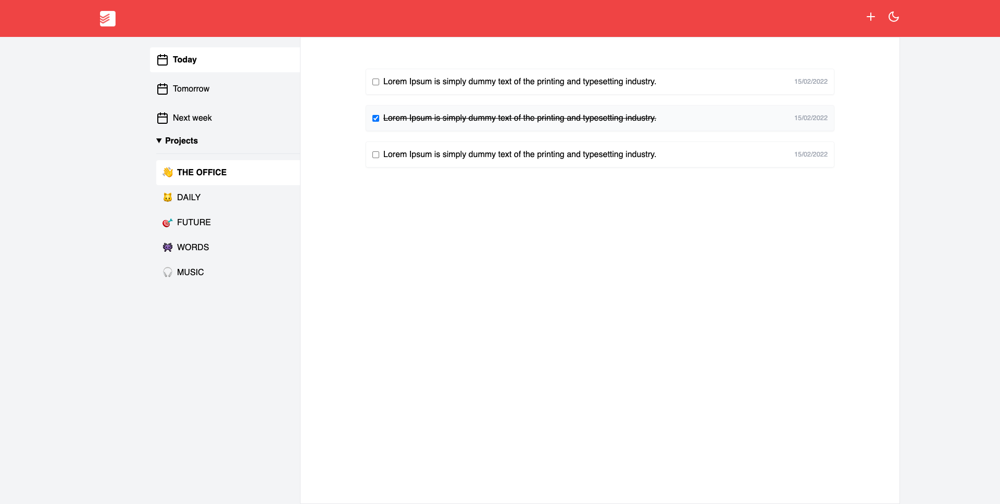

# Todoist clone with NextJS

## Built-in

- TypeScript
- NextJS
- Google Firebase
- Jest/Testing Library
- Tailwind CSS

## Screenshot



[Live App Preview](https://todoist-clone-gamma.vercel.app)

## Setup

```
git clone https://github.com/alptarla/todoist-clone.git
cd todoist-clone
npm install
npm run dev
```

### Note: you must add firebase config in env file

```
NEXT_PUBLIC_FIREBASE_API_KEY=
NEXT_PUBLIC_FIREBASE_AUTH_DOMAIN=
NEXT_PUBLIC_FIREBASE_PROJECT_ID=
NEXT_PUBLIC_FIREBASE_STORAGE_BUCKET=
NEXT_PUBLIC_FIREBASE_MESSAGING_SENDER_ID=
NEXT_PUBLIC_FIREBASE_APP_ID=
```
